# AWS WAF Operations Dashboards

[View this page in English](README.md)

#### Construa dashboards multi-contas no Elasticsearch para operação e investigação de logs do AWS Web Application Firewall

Neste repositório, compartilhamos um código para construção de infra-estrutura de coleta, enriquecimento e visualização de logs do AWS Web Application Firewall. Implementando esse projeto em sua conta AWS você poderá visualizar e filtrar os logs através de dashboards do Kibana abaixo, assim como customizar visualizações e dashboards de acordo com a sua necessidade.

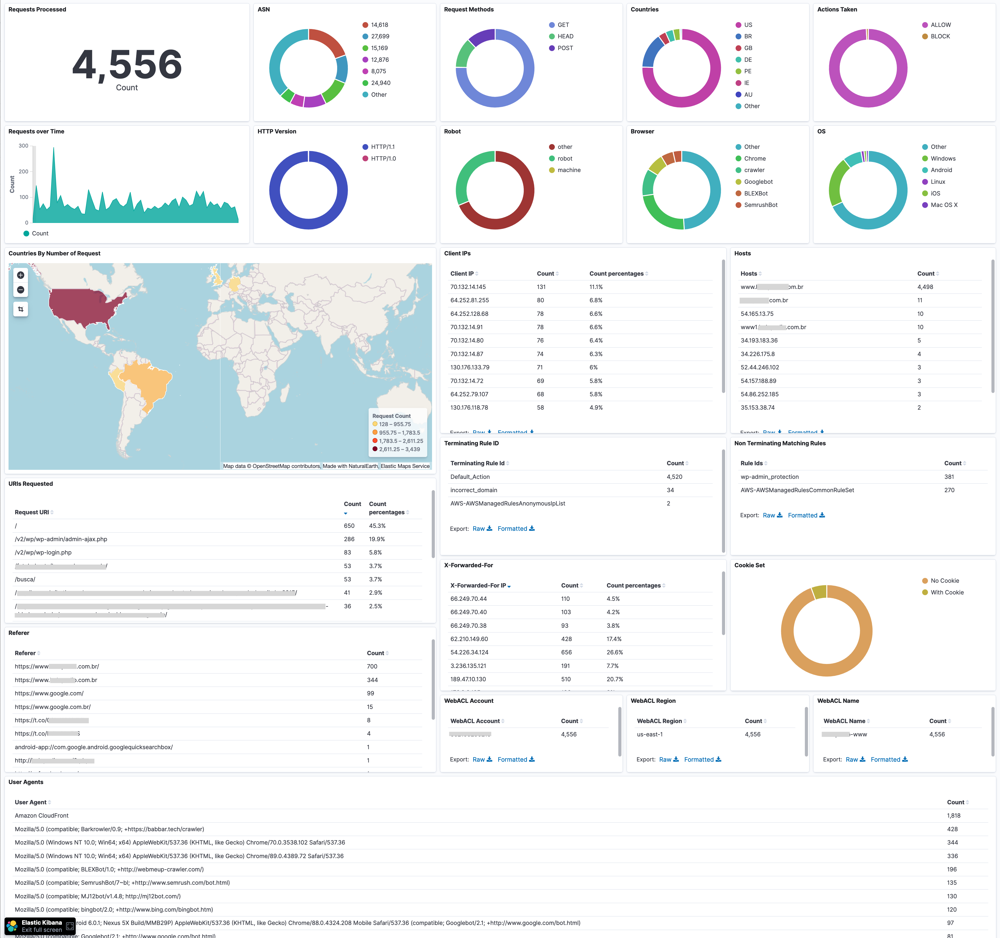

### Serviços AWS utilizados

Seguindo os passos abaixo, você irá criar uma infra-estrutura na sua conta AWS conforme o diagrama abaixo, usando os seguintes serviços da AWS:
* Amazon Kinesis Data Firehose
* Amazon Cognito
* Amazon Elasticsearch Service
* Amazon S3
* Amazon EventBridge
* AWS CodeBuild
* AWS Lambda

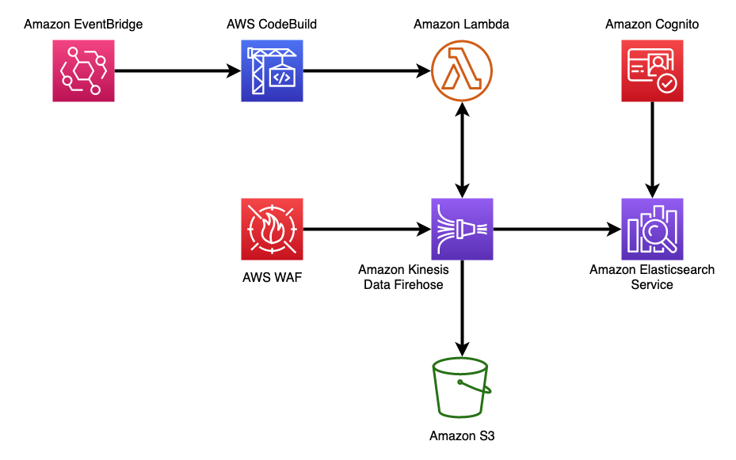

### Instalação

Para fazer a instalação, inicialmente precisaremos construir uma função AWS Lambda, e para isso usaremos o AWS CloudShell. Você poderá abrir o CloudShell clicando em seu ícone na barra superior da Console da AWS, conforme figura abaixo.


Quando o CloudShell abrir, iremos executar os comandos a seguir, substituindo o valor &lt;bucket_name&gt; por um nome de bucket único que você escolher:

```
aws s3 mb s3://<bucket_name>
wget https://aws-waf-operations.s3.amazonaws.com/create_esconfig.sh
chmod +x create_esconfig.sh
./create_esconfig.sh <bucket_name>
```

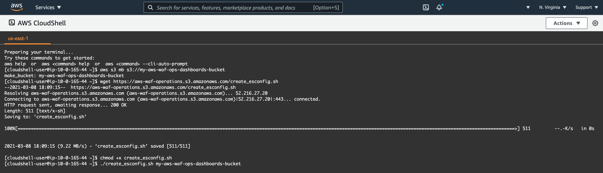

Depois de executar os comando acima no CloudShell, copie o arquivo `waf-operations.yaml` deste repositório para uma pasta local. Em seguida abra a console da AWS no serviço *CloudFormation*, clique em *Create Stack*, selecione *With new resources (standard)*, depois na seção *Template source* selecione *Upload a template file*, clique em *Choose file* e escolha o arquivo que você copiou para sua pasta local. Finalmente clique em *Next*:

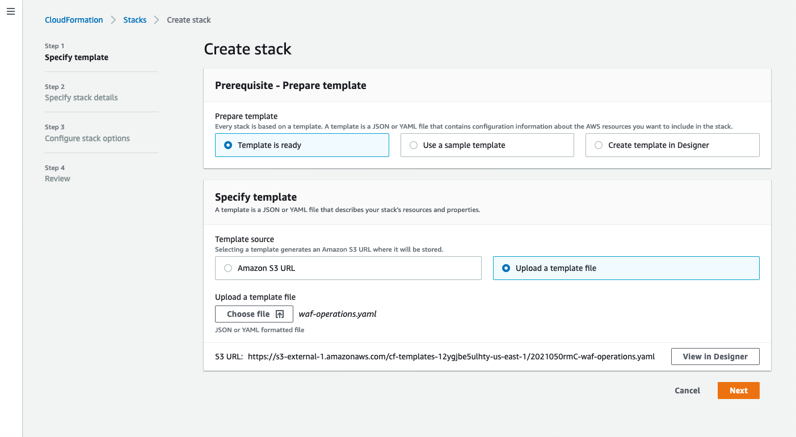

Na próxima tela, defina um nome para a stack e preencha os parâmetros obrigatórios. O parâmetro ESConfigBucket é o nome que você escolheu para o bucket criado com o CloudShell e YourEmail é o endereço de e-mail em que você receberá as credenciais temporárias para autenticação no Amazon Cognito. Em seguida clique em *Next*, e novamente em *Next*

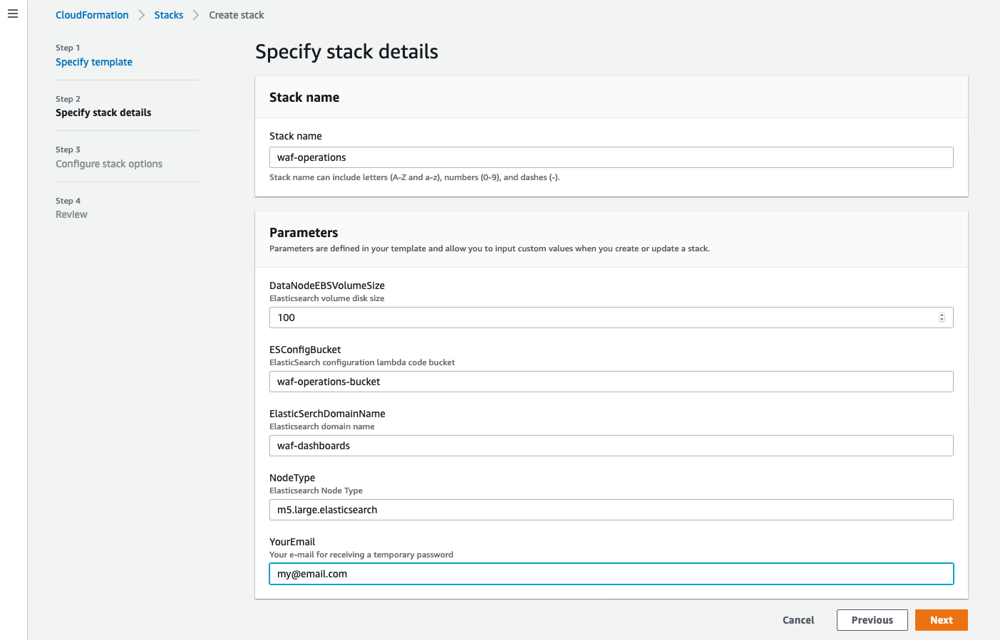

Na última tela, autorize o AWS CloudFormation a criar recursos do IAM e clique em *Create stack*:

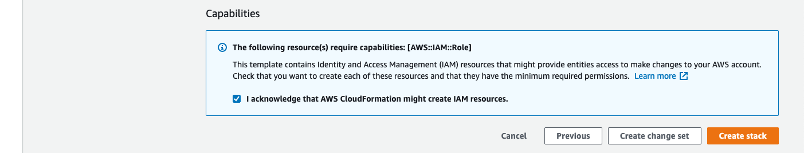

O próximo passo deve demorar de 30 a 40 minutos:

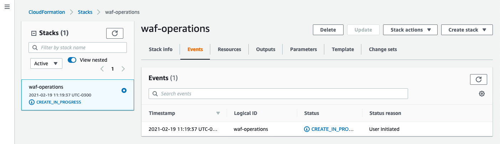

Durante o processo, você deve receber um e-mail com credenciais temporárias:

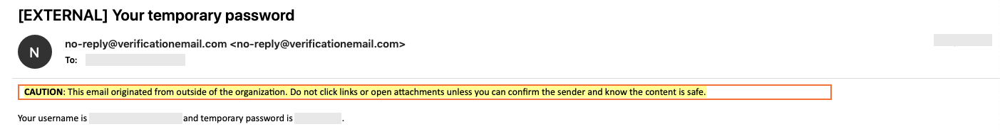

Quando o processo de deploy for concluído, podemos acessar o dashboard do Kibana através de sua URL. Se precisar utilizar diretamente o ElasticSearch, sua URL também está disponível. Elas podem ser encontradas na aba Outputs do CloudFormation:

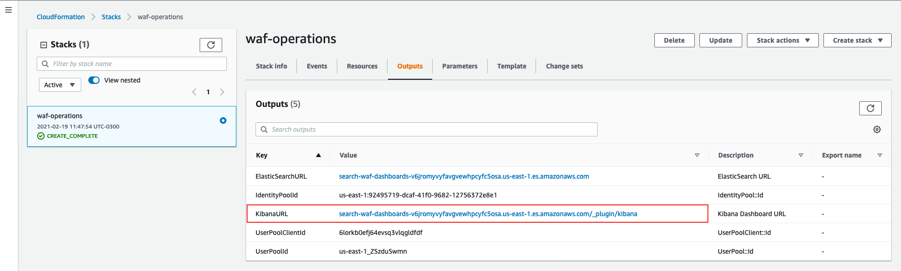

A tela do Cognito será exibida. Utilize as credenciais enviadas por e-mail:


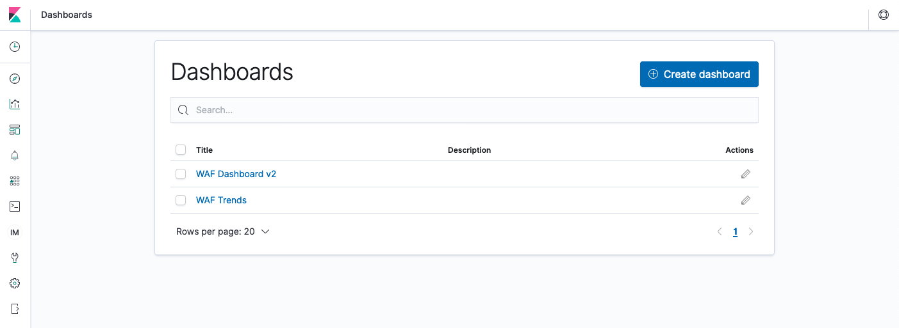


Ao abrir os dashboards, você perceberá que eles estão sem dados. Para que os dados comecem a ser populados, acesse a console do AWS WAF, e ative os logs, direcionando-os para o Kinesis Data Firehose criado através deste projeto. Assim que as requisições começarem a chegar e ser processadas você poderá fazer um *Refresh* dos dados e começar seu trabalho de visualização, análise e investigação das requisições às suas aplicações protegidas pelo AWS WAF:

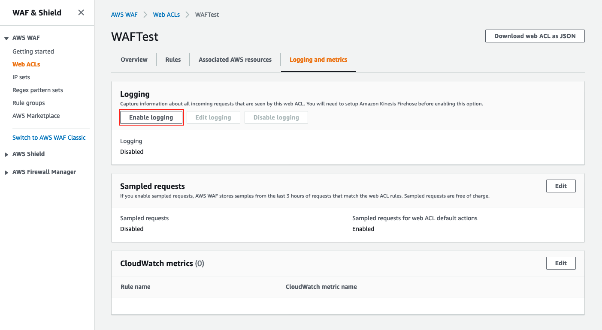

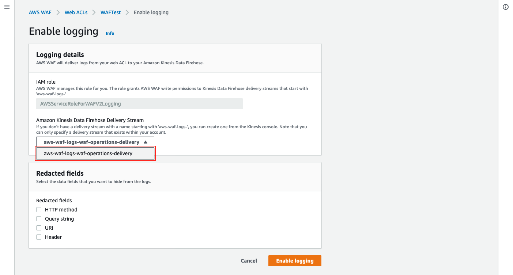

E estes são os dashboards com dados:


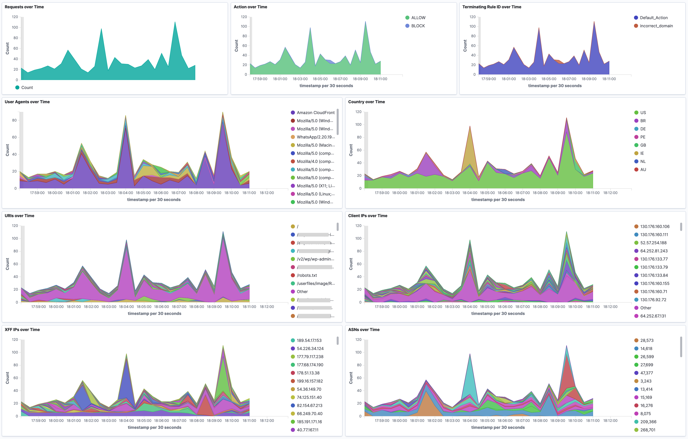

### Desinstalação

Para remover a solução, remova a configuração do AWS WAF para enviar logs para esta solução, aguarde alguns minutos para todos os logs serem processados e exclua a stack através da console do AWS CloudFormation.

AVISO: Quando apagado, o backup dos logs armazenados no bucket S3 criado pela solução será apagado assim como o bucket.
